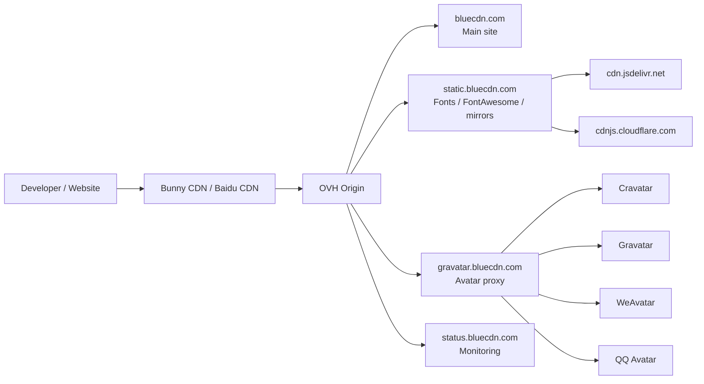

<div align="center">
  

  <h1>BlueCDN</h1>

  <p>
    A practical CDN toolkit for front-end assets, web fonts, avatars, and developer-friendly mirrors.
  </p>

  <p>
    <a href="https://bluecdn.com">bluecdn.com</a>
    ·
    <a href="https://static.bluecdn.com">static.bluecdn.com</a>
    ·
    <a href="https://gravatar.bluecdn.com">gravatar.bluecdn.com</a>
    ·
    <a href="https://status.bluecdn.com">status</a>
  </p>

  <p>
    
    
    
    
    
  </p>
</div>

---

## What Is BlueCDN?

BlueCDN is a small, domain-oriented CDN ecosystem built for real-world front-end development.

It focuses on mirrors and static resources that are simple to use, easy to cache, and friendly to developers working across different network environments.

## Services

| Domain | Purpose | Status |
|---|---|---|
| [bluecdn.com](https://bluecdn.com) | Main site for JS/CSS package search, quick CDN links, and mirror usage. | Active |
| [static.bluecdn.com](https://static.bluecdn.com) | Static resource CDN for web fonts, FontAwesome, jsDelivr/cdnjs-style proxy paths, and public assets. | Active |
| [gravatar.bluecdn.com](https://gravatar.bluecdn.com) | Gravatar-compatible avatar proxy with Cravatar, Gravatar, WeAvatar, QQ avatar fallback, and edge caching. | Active |
| [status.bluecdn.com](https://status.bluecdn.com) | Service status and operational visibility. | Planned |

## Repositories

| Repository | Description |
|---|---|
| `bluecdn.com` | Main BlueCDN website and package discovery service. |
| `bluecdn.static` | Deployment source for `static.bluecdn.com`, including Caddy config, static page assets, font manifest, and CDN routing notes. |
| `LiteAvatar` | Go avatar proxy powering `gravatar.bluecdn.com`. |

## Architecture

BlueCDN is organized around subdomains instead of one large monolith.



## Design Principles

- Domain-first organization: every service has a clear subdomain and responsibility.
- Cache-friendly URLs: static assets should be easy to reuse and safe to cache.
- Minimal operational surface: prefer simple services, Caddy routing, and clear deployment paths.
- China-friendly access: combine domestic and overseas CDN routing where it matters.
- Open, practical documentation: repositories should explain what runs where and why.

## Current Consolidation

The project is being reorganized into a single local workspace:

```text
BlueCDN/
  bluecdn.com/             Main site and package discovery
  static.bluecdn.com/      Static assets, fonts, FontAwesome, CDN proxy
  gravatar.bluecdn.com/    LiteAvatar avatar proxy
  status.bluecdn.com/      Status service
  _local/                  Local-only scripts, secrets, sync workspaces
  _archive/                Old R2/static experiments before deletion
```

## Public Interfaces

```html
<!-- JS/CSS package mirror style -->
<script src="https://static.bluecdn.com/npm/vue@3/dist/vue.global.prod.js"></script>

<!-- FontAwesome -->
<link rel="stylesheet" href="https://static.bluecdn.com/libs/fontawesome/7.3.0/css/all.min.css">

<!-- Web fonts -->
<link rel="stylesheet" href="https://static.bluecdn.com/fonts/noto-sans-sc.css">

<!-- Avatar proxy -->

```

---

<div align="center">
  <p>
    Built for developers who just need stable front-end resources that work.
  </p>
</div>
